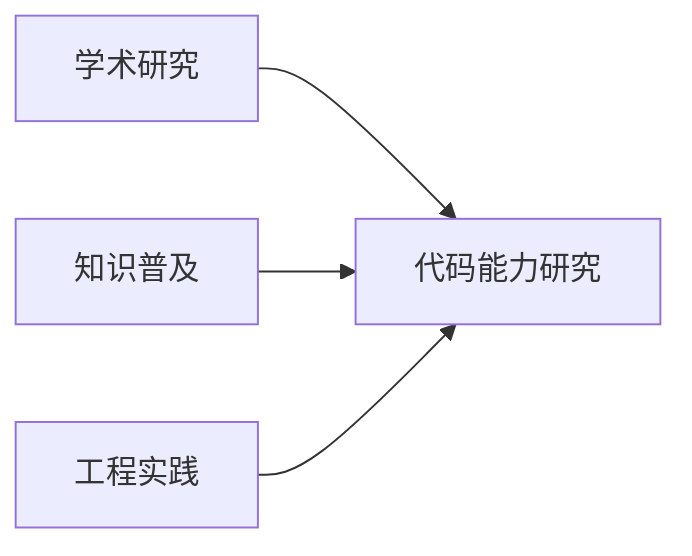

# LLM 代码能力调研

> 探索大语言模型的代码生成能力

## 项目概览

本项目通过"三位一体"的方式，全方位探索大语言模型在代码生成领域的能力：

## 主要内容

- **[项目说明](readme/README.md)**：详细了解项目背景、目标和架构
- **[研究内容](research/code_capability.md)**：深入探讨大模型代码能力
- **[实验验证](experiments/leetcode/README.md)**：基于 LeetCode 的实践研究
- **[开发日志](misc/DEVLOG.md)**：项目进展与思考记录

## 参考资料

- [A Survey on Large Language Models for Code Generation](https://arxiv.org/abs/2406.00515) 