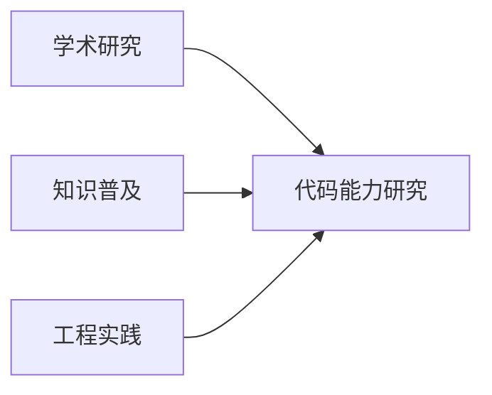

# LLM Code Survey

> 大模型代码生成能力研究项目

## 项目简介

本项目是一个融合学术研究、知识普及与工程实践的开源项目，致力于探索和理解大语言模型在代码生成领域的能力。



### 三大支柱

- **学术研究** (paper)
  - 系统化的理论研究
  - 基于最新学术进展
  - 产出研究发现

- **知识普及** (docs)
  - 经验分享与教育
  - 完整知识体系
  - 服务学习需求

- **工程实践** (src)
  - 基准测试实现
  - 实验数据收集
  - 验证与优化

## 项目特色

1. **理论基础**
   - 基于最新学术研究成果
   - 以 J Jiang 等人的综述为理论框架
   - 建立系统评估方法

2. **实践导向**
   - 采用 LeetCode Hot 100 作为基准测试集
   - 积累第一手实验数据
   - 验证理论研究发现

3. **知识分享**
   - 构建完整知识体系
   - 注重经验传递
   - 服务学习需求

## 快速开始

1. 克隆项目
```bash
git clone https://github.com/yourusername/llm-code-survey.git
cd llm-code-survey
```

2. 查看文档
```bash
npm i docsify-cli -g
docsify serve docs
```

## 项目结构

```
project/
├── paper/     # 学术研究
├── docs/      # 知识文档
└── src/       # 代码实现
```

## 参考文献

- J Jiang, et al. "A Survey on Large Language Models for Code Generation." arXiv:2406.00515, 2024 