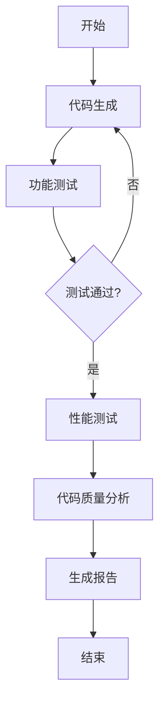

# 代码能力研究

## 研究维度

1. **代码生成能力**
   - 正确性
   - 效率
   - 可读性

2. **问题理解能力**
   - 需求分析
   - 边界条件处理
   - 异常情况考虑

3. **代码优化能力**
   - 时间复杂度优化
   - 空间复杂度优化
   - 代码结构优化

## 评估方法

### 性能评估

时间复杂度计算示例：

$$
T(n) = O(n \log n)
$$

空间复杂度分析：

$S(n) = O(n)$ 表示线性空间复杂度

### 评估流程



### 示例代码

```python
def evaluate_model(model, test_cases):
    results = {
        'correctness': 0,
        'efficiency': 0,
        'readability': 0
    }
    
    for test in test_cases:
        # 评估逻辑
        pass
        
    return results
```
